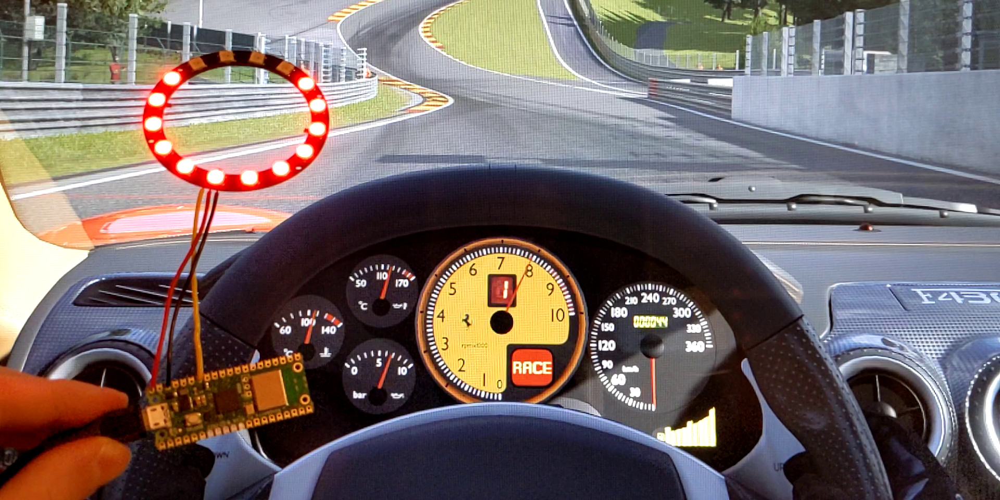

# DIY RPM lights for Gran Turismo 7



This project lets you make external RPM lights for Gran Turismo 7.

You're going to need a Raspberry Pi Pico W and some NeoPixels (WS2812 LEDs). It talks directly to your PlayStation over wifi, so a PC is only required for configuration, not during normal operation.

Wire your NeoPixels to the Pico by connecting the power pin to VBUS on the Pico, GND to GND, and the data pin to one of the GPIO pins on the Pico.

Then flash the firmware onto the Pico by doing the following. Press and hold the BOOTSEL button and while holding it, connect the Pico to your computer. A drive named "RPI-RP2" should appear. Copy the [rpm.uf2](rpm.uf2) file to that drive. That's it.

Then, while still having it connected to a computer, go to [this website](https://www.jfedor.org/gt7-rpm-lights-config/) to configure it. After it connects to your wifi, you no longer need the computer, you can power the device from a phone charger or something like that.

If all the LEDs are blue, it means it's not (yet?) connected to wifi.

## How to compile

```
git clone https://github.com/jfedor2/gt7-rpm-lights.git
cd gt7-rpm-lights
git submodule update --init
cd pico-sdk
git submodule update --init
cd ..
mkdir build
cd build
cmake ..
make
```

## Acknowledgements

Thanks to [Nenkai](https://github.com/Nenkai) for details on the protocol.

[Salsa20 cipher implementation](https://github.com/alexwebr/salsa20) by [alexwebr](https://github.com/alexwebr) (public domain).

`ws2812.c` and `ws2818.pio` files are derived from [Pico SDK examples](https://github.com/raspberrypi/pico-examples). They come with the following license:

```
Copyright 2020 (c) 2020 Raspberry Pi (Trading) Ltd.

Redistribution and use in source and binary forms, with or without modification, are permitted provided that the
following conditions are met:

1. Redistributions of source code must retain the above copyright notice, this list of conditions and the following
   disclaimer.

2. Redistributions in binary form must reproduce the above copyright notice, this list of conditions and the following
   disclaimer in the documentation and/or other materials provided with the distribution.

3. Neither the name of the copyright holder nor the names of its contributors may be used to endorse or promote products
   derived from this software without specific prior written permission.

THIS SOFTWARE IS PROVIDED BY THE COPYRIGHT HOLDERS AND CONTRIBUTORS "AS IS" AND ANY EXPRESS OR IMPLIED WARRANTIES,
INCLUDING, BUT NOT LIMITED TO, THE IMPLIED WARRANTIES OF MERCHANTABILITY AND FITNESS FOR A PARTICULAR PURPOSE ARE
DISCLAIMED. IN NO EVENT SHALL THE COPYRIGHT HOLDER OR CONTRIBUTORS BE LIABLE FOR ANY DIRECT, INDIRECT, INCIDENTAL,
SPECIAL, EXEMPLARY, OR CONSEQUENTIAL DAMAGES (INCLUDING, BUT NOT LIMITED TO, PROCUREMENT OF SUBSTITUTE GOODS OR
SERVICES; LOSS OF USE, DATA, OR PROFITS; OR BUSINESS INTERRUPTION) HOWEVER CAUSED AND ON ANY THEORY OF LIABILITY,
WHETHER IN CONTRACT, STRICT LIABILITY, OR TORT (INCLUDING NEGLIGENCE OR OTHERWISE) ARISING IN ANY WAY OUT OF THE USE OF
THIS SOFTWARE, EVEN IF ADVISED OF THE POSSIBILITY OF SUCH DAMAGE.
```
